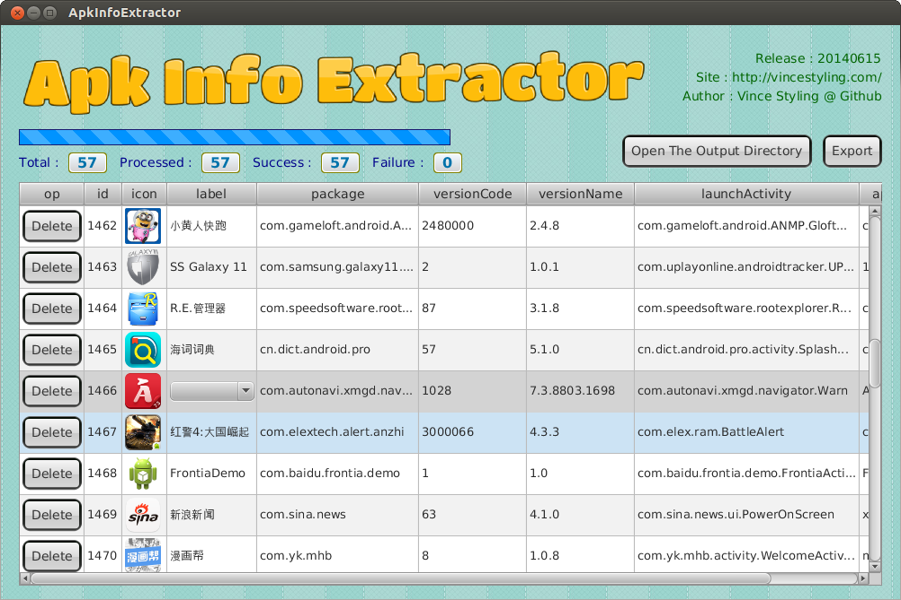
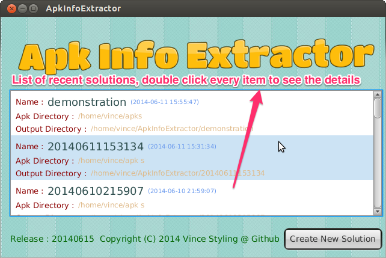
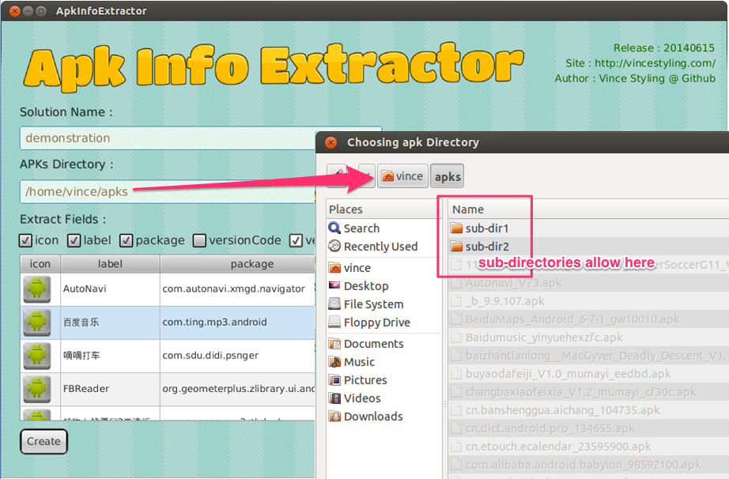
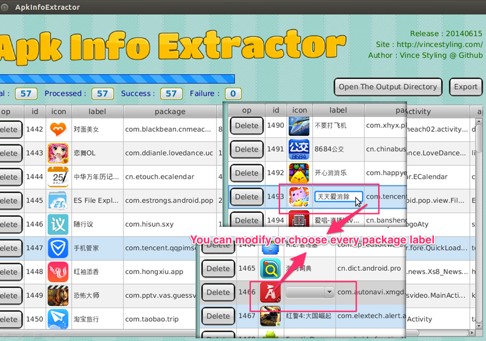
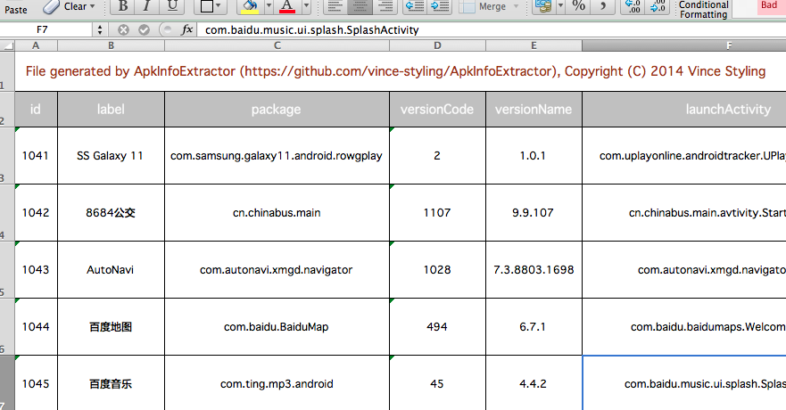
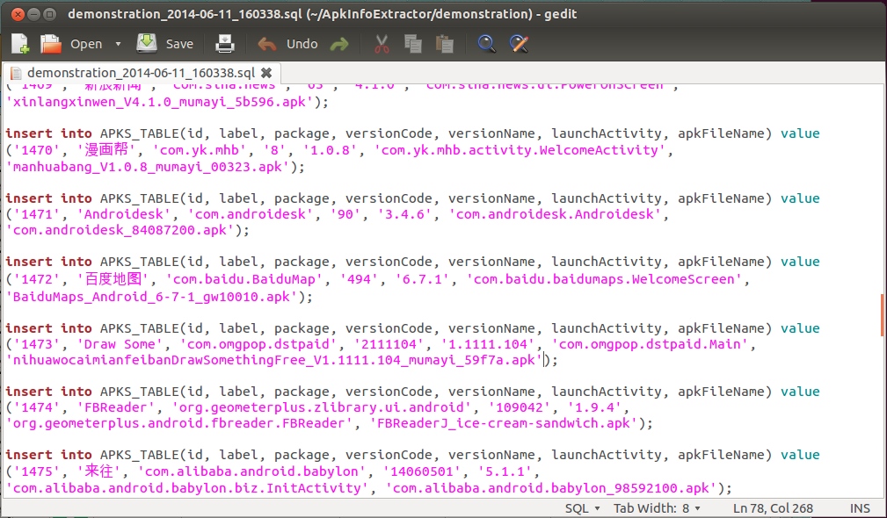
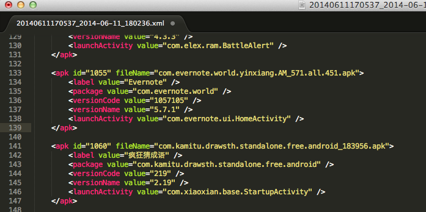
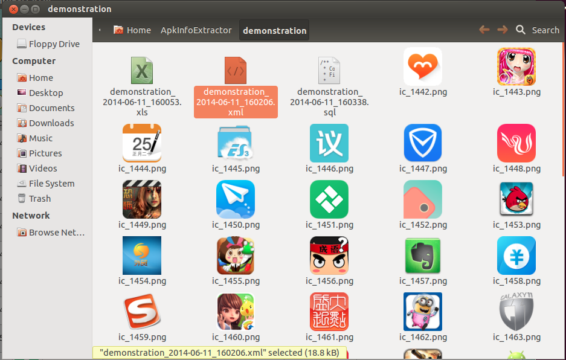

### Introduction

ApkInfoExtractor is an aapt(Android Asset Packaging Tool) wrapper, developed by JavaFX2.2,
aim to export android application file's information(e.g label, icon, package, versionCode, versionName etc.)
via straightforward and friendly graphic user interface, help you batch extracting apks information,
finally export the result as excel or xml or sql.

### Main Page

### Splash Page

ApkInfoExtractor naming every export operation as a solution, each solution modify(create, apk list adjustment) would be **synchronize** to the application's database(called db4o).
This function allow you look back to the previous solutions, you can continue your job even after some unexpectable interrupt things happened(power cut, computer force reboot).

### Wizard Page

In the Solution create wizard page, we suggest you give a meaningful name when creating new task, but that wasn't required,
if you leave it blank, current datetime would being the solution name.

When you have plentiful apk files, you maybe re-classify them to separate directories or create some sub-directories to avoid
cause file-browsing slow problem, in fact, we considered this situation, allow you choose a directory who included any count unhidden sub-directories.

In the "Extract Fields", you can choose which fields you want to export, as long as you turn on the checkbox of field,
below TableView show the sample data of that field immediately, you can turn off each checkbox to exclude.

About icon extracting, we preferred the dimension is 72x72, the icon which used that size will export, otherwise, we will resize the largest icon to 72x72.

### Launch Page

For internationalization reason, some application offered multiple labels, ApkInfoExtractor fetch all label then display as a ComboBox,
user can choose one or modify as well.

### Export Result

We achieved three export schemes :

#### Export to excel :

#### Export to sql :

#### Export to xml :

except excel, the xml and sql export syntax was editable, see the details in runtime.

### About the output directory

All the solution dependency file are stored in the output directory, it contained icon files, database file, export files :

